# Nifty Options Intelligence System
### The Complete Encyclopedia — From Raw CSV to Live Trade

> **"We're right 50.75% of the time, but we're 100% right 50.75% of the time. You can make billions that way."**
> — Robert Mercer, Co-CEO Renaissance Technologies

---

## Table of Contents

1. [What This System Does](#1-what-this-system-does)
2. [The Big Picture — How Everything Connects](#2-the-big-picture)
3. [Project Structure](#3-project-structure)
4. [Quick Start — Run in 5 Minutes](#4-quick-start)
5. [Your Data Files Explained](#5-your-data-files-explained)
6. [The Machine Learning Pipeline](#6-the-machine-learning-pipeline)
7. [The 55+ Features Explained](#7-the-55-features-explained)
8. [The Signal Engine — How a Trade is Chosen](#8-the-signal-engine)
9. [VIX Regime Rules — The Core Logic](#9-vix-regime-rules)
10. [How to Take a Trade — Step by Step](#10-how-to-take-a-trade)
11. [The 4 Strategies Explained](#11-the-4-strategies-explained)
12. [The 10 Golden Rules](#12-the-10-golden-rules)
13. [P&L Simulator — Monte Carlo](#13-pl-simulator)
14. [Trade Journal — Tracking & Improving](#14-trade-journal)
15. [Every Page in the Dashboard](#15-every-page-in-the-dashboard)
16. [Frequently Asked Questions](#16-frequently-asked-questions)
17. [Disclaimer](#17-disclaimer)

---

## 1. What This System Does

This is a **systematic options trading system** for Nifty 50. It combines:

- **Real historical data** (your 10 CSV files from 2001 to now)
- **Machine learning** (XGBoost trained on 55+ features)
- **Options strategy selection** (4 strategies based on confidence + VIX)
- **Risk management** (10 golden rules, position sizing, stop losses)
- **A Streamlit dashboard** (6 pages, live charts, trade journal)

The goal is simple: **₹1 Lakh capital → ₹5,000/month profit** with 60% model accuracy and 2% risk per trade.

---

## 2. The Big Picture

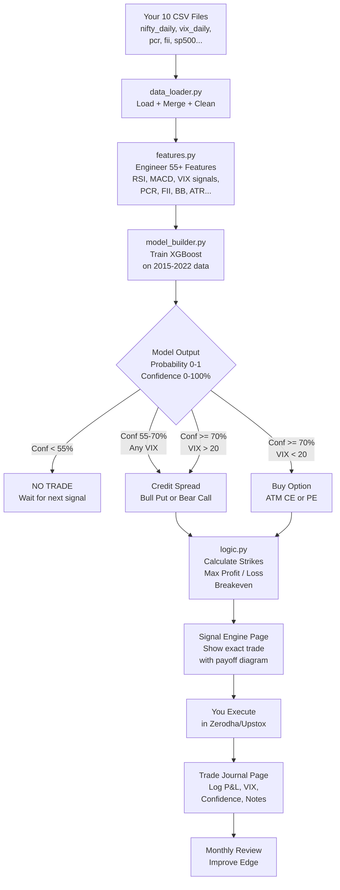

---

## 3. Project Structure

```
jacob-ml/
│
├── app.py                          ← Main entry point. Run this.
├── requirements.txt                ← Python packages needed
├── README.md                       ← This file
│
├── data/                           ← YOUR CSV FILES GO HERE
│   ├── nifty_daily.csv
│   ├── nifty_15m_2001_to_now.csv
│   ├── vix_daily.csv
│   ├── INDIAVIX_15minute_2001_now.csv
│   ├── bank_nifty_daily.csv
│   ├── sp500_daily.csv
│   ├── fii_dii_daily.csv
│   ├── events.csv
│   ├── pcr_daily.csv
│   └── vix_term_daily.csv
│
├── pages/                          ← One file per dashboard page
│   ├── dashboard.py                ← Overview + Monte Carlo + charts
│   ├── data_explorer.py            ← Inspect your CSVs
│   ├── signal_engine.py            ← Live trade signal
│   ├── pnl_simulator.py            ← Monte Carlo simulator
│   ├── model_builder.py            ← Train XGBoost
│   ├── trade_journal.py            ← Log and track trades
│   └── strategy_guide.py          ← Strategy reference + Golden Rules
│
└── utils/                          ← Shared logic
    ├── data_loader.py              ← Reads and merges all CSVs
    ├── features.py                 ← Engineers all 55+ features
    └── logic.py                   ← Signal engine + trade setup math
```

---

## 4. Quick Start

### Step 1 — Install Python packages

```bash
cd jacob-ml
pip install -r requirements.txt
```

### Step 2 — Copy your CSV files

Copy all 10 CSV files from your `data/` folder into `jacob-ml/data/`:

```
bank_nifty_daily.csv
events.csv
fii_dii_daily.csv
INDIAVIX_15minute_2001_now.csv
nifty_15m_2001_to_now.csv
nifty_daily.csv
pcr_daily.csv
sp500_daily.csv
vix_daily.csv
vix_term_daily.csv
```

### Step 3 — Run the app

```bash
streamlit run app.py
```

Open `http://localhost:8501` in your browser.

### Step 4 — Train the model (first time only)

1. Go to **Model Builder** page
2. Set train/val years (e.g. train until 2021, validate until 2023)
3. Click **"Load Data & Train XGBoost"**
4. Wait ~30 seconds
5. Model is saved in session — go to **Signal Engine** to get today's trade

---

## 5. Your Data Files Explained

| File | What it contains | Why it matters |
|------|-----------------|----------------|
| `nifty_daily.csv` | Nifty 50 OHLCV since 2001 | Core price data. Every feature starts here. |
| `vix_daily.csv` | India VIX since 2001 | #1 predictor. Controls which strategy to use. |
| `nifty_15m_2001_to_now.csv` | Nifty 15-min bars | Used for intraday pattern features |
| `INDIAVIX_15minute_2001_now.csv` | VIX 15-min | Intraday VIX spikes = reversal signals |
| `bank_nifty_daily.csv` | Bank Nifty OHLCV | Bank Nifty leads Nifty by 1-2 days |
| `sp500_daily.csv` | S&P 500 daily | Global context — US fall → Nifty gap-down |
| `fii_dii_daily.csv` | FII/DII net buy/sell | Institutional money flow = strongest trend signal |
| `pcr_daily.csv` | Put-Call Ratio | Contrarian sentiment: PCR > 1.2 = bullish |
| `vix_term_daily.csv` | VIX near vs far month | Contango/backwardation tells regime direction |
| `events.csv` | Budget, expiry, holidays | Calendar context features |

### How they get merged

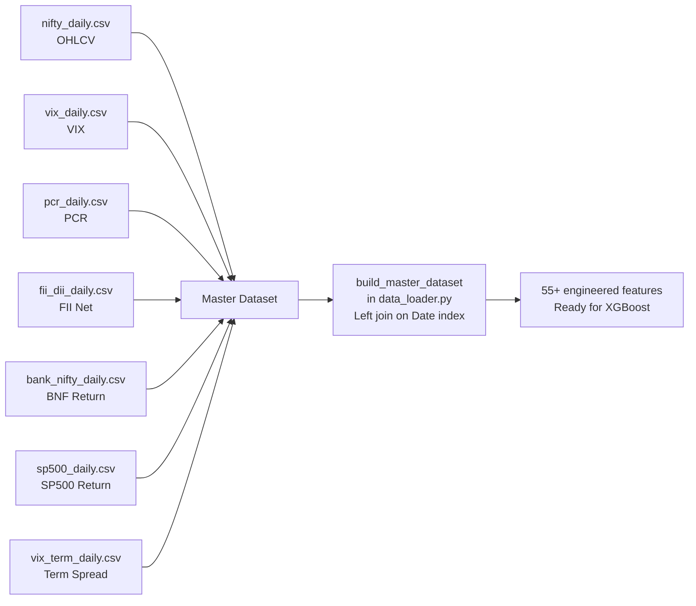

All files are joined on their date index. Missing values are forward-filled so that the latest row always has valid data for live prediction.

---

## 6. The Machine Learning Pipeline

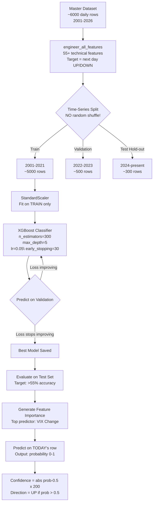

### Why XGBoost and not deep learning?

Research paper "StockBot 2.0" (Mohanty, 2026) confirmed that vanilla LSTMs and XGBoost consistently outperform Transformers for financial time-series with limited data. XGBoost wins because:

- Trains in 30 seconds vs 30 minutes for LSTM
- Interpretable via feature importance
- Handles missing values natively
- Less prone to overfitting on small datasets
- Ensemble of 300 trees = robust to noise

### Realistic accuracy expectations

| Model | Expected Accuracy | Timeline |
|-------|------------------|----------|
| Logistic Regression | 52-54% | Week 1-2 |
| Random Forest | 54-57% | Week 3-4 |
| XGBoost | 57-62% | Week 5-6 |
| XGBoost + all CSVs | 59-65% | Week 7-8 |

**55%+ is profitable.** You do not need 90% accuracy. Renaissance Technologies makes billions with 50.75% accuracy.

---

## 7. The 55+ Features Explained

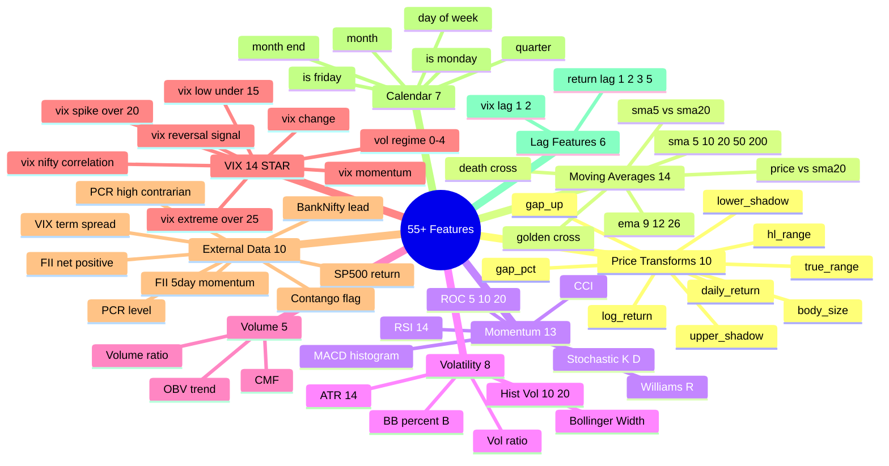

### The most important features (from XGBoost)

| Rank | Feature | Category | Why it predicts |
|------|---------|----------|----------------|
| 1 | `vix_change` | VIX | A sudden VIX spike means panic → reversal coming |
| 2 | `rsi` | Momentum | RSI < 30 = oversold = bounce likely |
| 3 | `macd_hist` | Momentum | MACD crossing zero = trend change |
| 4 | `pcr_high` | PCR | Too many bears in options = market will squeeze up |
| 5 | `vix_spike` | VIX | VIX > 20 = sell options, don't buy |
| 6 | `fii_momentum` | FII | FII buying 5 days in a row = strong bull signal |
| 7 | `bb_width` | Volatility | Narrow BB = breakout incoming |
| 8 | `stoch_k` | Momentum | Stochastic crossover = momentum shift |
| 9 | `volume_ratio` | Volume | Volume spike confirms move direction |
| 10 | `sp500_positive` | Global | US market direction carries over to India |

---

## 8. The Signal Engine

This is the brain. Every day after market close (3:30 PM IST), run this process:

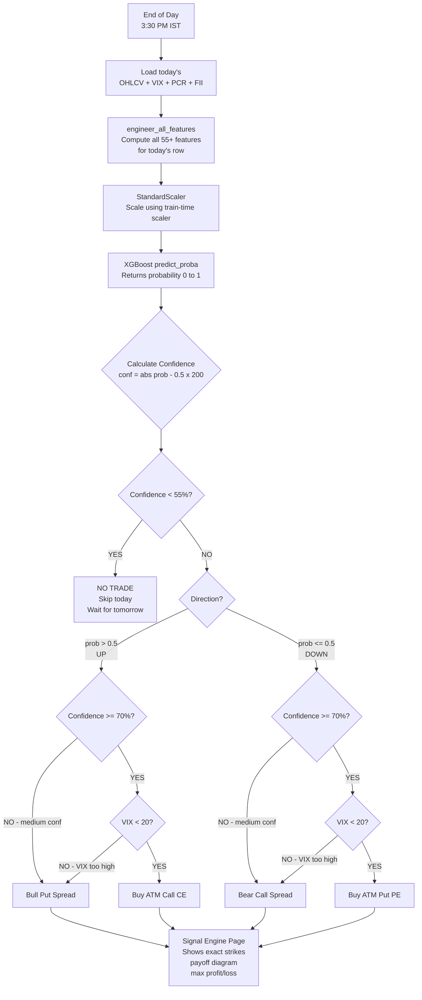

### Reading the confidence score

```
Model probability = 0.72 (72% chance of UP move)

Confidence = |0.72 - 0.50| × 200 = 0.22 × 200 = 44%

Wait — 44% < 55% threshold → NO TRADE

Model probability = 0.84 (84% chance of UP move)

Confidence = |0.84 - 0.50| × 200 = 0.34 × 200 = 68%

68% >= 55% and < 70% → Medium confidence → Credit Spread
VIX = 18 (normal) → Bull Put Spread ✓
```

---

## 9. VIX Regime Rules

India VIX is the **single most important external signal** in this system. It determines which strategy to use regardless of the model's direction prediction.

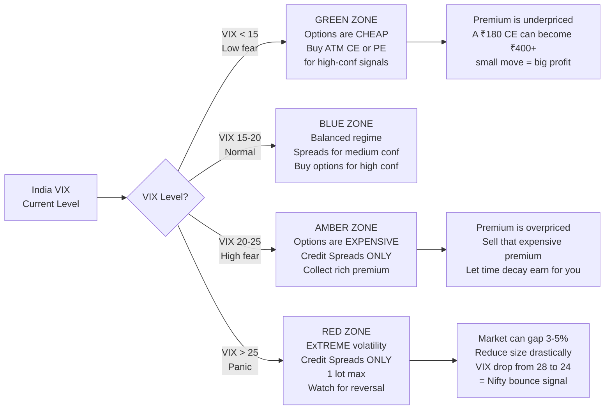

### Why VIX > 20 means SELL not BUY options

When VIX is 22, an ATM option that normally costs ₹150 might cost ₹280. You are paying a 87% premium for the same option. The market is pricing in a massive move. Most of the time, that massive move doesn't happen and the option expires worth less. So instead of paying ₹280 for an option, you SELL a spread and COLLECT ₹220+ in premium with defined risk.

---

## 10. How to Take a Trade — Step by Step

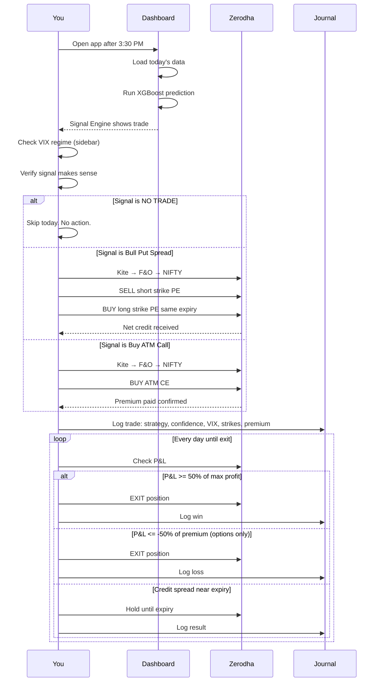

### The daily routine

```
Before market open (9:00 AM):
  ✓ Check India VIX — what regime are we in today?
  ✓ Check if any open positions need attention (P&L check)
  ✓ Check for major events (budget, expiry, RBI policy)

After market close (3:30 PM):
  ✓ Open Streamlit dashboard
  ✓ Go to Signal Engine page
  ✓ Note: Model confidence, direction, VIX
  ✓ If confidence >= 55%: plan the trade
  ✓ Execute in Zerodha before 3:45 PM (or next morning pre-open)

After executing:
  ✓ Go to Trade Journal page
  ✓ Log all details: date, strategy, strikes, confidence, VIX, premium
  ✓ Set a calendar reminder for exit conditions
```

---

## 11. The 4 Strategies Explained

### Strategy 1: Bull Put Spread

**When:** Model says UP, confidence 55-70%, any VIX (preferred VIX > 15)

```
Example with Nifty at 24,000:
  
  SELL  23,700 PE @ ₹45
  BUY   23,500 PE @ ₹20
  ─────────────────────
  Net Credit = ₹25 × 100 = ₹2,500
  Margin     = ₹20,000
  
  WIN if Nifty stays above 23,700 at expiry (probability ~70%)
  
  Max Profit  = ₹2,500  (if Nifty > 23,700)
  Breakeven   = 23,675  (short strike - net premium)
  Max Loss    = ₹17,500 (if Nifty < 23,500)
```

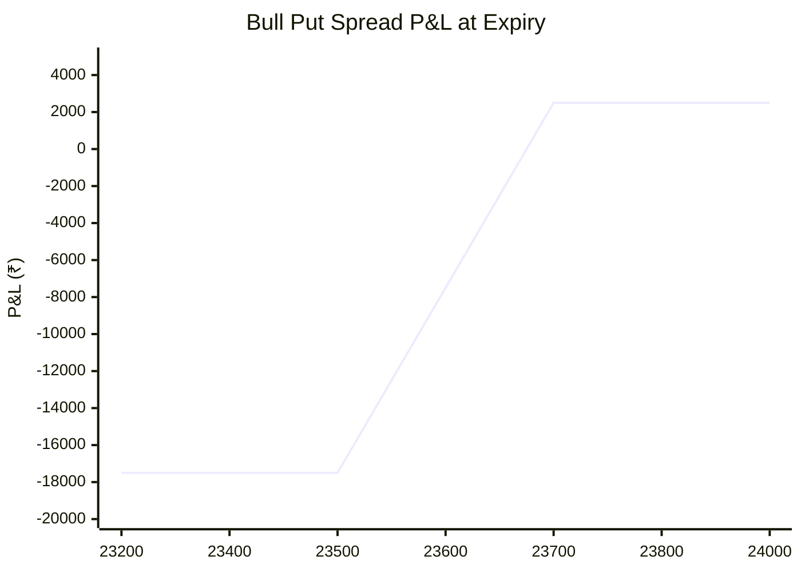

**Exit rules:**
- Book profit when P&L reaches ₹1,250 (50% of ₹2,500 max)
- If Nifty breaks below short strike with >7 DTE remaining → roll to next expiry
- Hold to expiry if trade is comfortable (risk already defined)

---

### Strategy 2: Bear Call Spread

**When:** Model says DOWN, confidence 55-70%, any VIX (preferred VIX > 15)

```
Example with Nifty at 24,000:
  
  SELL  24,200 CE @ ₹42
  BUY   24,400 CE @ ₹20
  ─────────────────────
  Net Credit = ₹22 × 100 = ₹2,200
  Margin     = ₹18,000
  
  WIN if Nifty stays below 24,200 at expiry (probability ~70%)
  
  Max Profit  = ₹2,200  (if Nifty < 24,200)
  Breakeven   = 24,222  (short strike + net premium)
  Max Loss    = ₹15,800 (if Nifty > 24,400)
```

**Exit rules:** Same as Bull Put Spread — book at 50%, roll if breached, hold to expiry otherwise.

---

### Strategy 3: Buy ATM Call (CE)

**When:** Model says UP, confidence >= 70%, VIX < 20

```
Example with Nifty at 24,000:
  
  BUY   24,000 CE @ ₹180
  Quantity = 15 units
  ─────────────────────
  Max Risk = ₹2,700 (100% of premium)
  
  WIN if Nifty moves above 24,180 before expiry
  
  Breakeven = 24,180
  Target    = Exit when premium > ₹270 (+50%)
  Stop Loss = Exit when premium < ₹90 (-50%)
```

**Why only when VIX < 20:** When VIX is 14, that ₹180 option is fairly priced. When VIX is 22, the same option costs ₹300+ and needs a massive move to be profitable. Never buy options in high VIX.

---

### Strategy 4: Buy ATM Put (PE)

**When:** Model says DOWN, confidence >= 70%, VIX < 20

```
Example with Nifty at 24,000:
  
  BUY   24,000 PE @ ₹175
  Quantity = 15 units
  ─────────────────────
  Max Risk = ₹2,625 (100% of premium)
  
  WIN if Nifty moves below 23,825 before expiry
  
  Breakeven = 23,825
  Target    = Exit when premium > ₹262 (+50%)
  Stop Loss = Exit when premium < ₹87  (-50%)
```

### Strategy selection summary

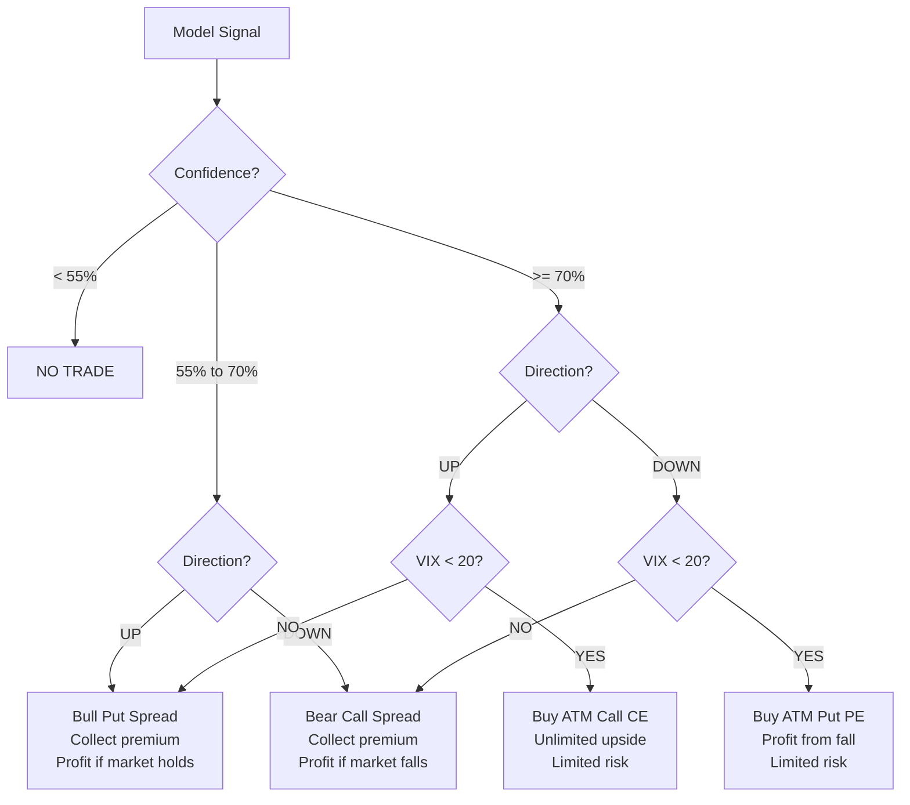

---

## 12. The 10 Golden Rules

These rules are hard-coded into the system logic. Breaking any rule is the #1 reason traders lose money.

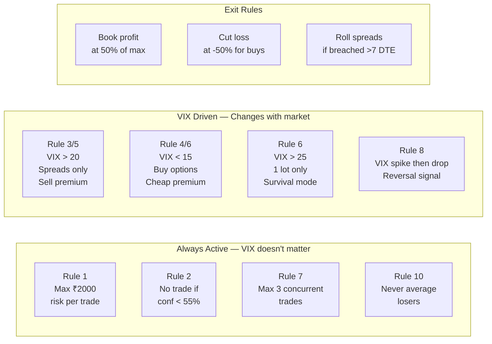

| # | Rule | When active | What happens if broken |
|---|------|------------|------------------------|
| 1 | Max 2% risk (₹2,000) | Always | One bad trade wipes 10%+ |
| 2 | No trade < 55% confidence | Always | You're gambling, not trading |
| 3 | Book profit at 50% | Always | Winners turn into losers |
| 4 | Cut loss at -50% for buys | Always | Catastrophic loss on single trade |
| 5 | Credit spreads when VIX > 20 | VIX > 20 | Paying overpriced premiums |
| 6 | Buy options when VIX < 15 | VIX < 15 | Missing best buying window |
| 7 | Max 3 concurrent trades | Always | Can't monitor, panic selling |
| 8 | Roll if position goes against | VIX any | Taking max loss unnecessarily |
| 9 | Review monthly | Monthly | Model degrades, no correction |
| 10 | Never average losers | Always | The #1 account blowup cause |

---

## 13. P&L Simulator

The simulator runs **Monte Carlo analysis** — 5,000 simulated trading months — to give you realistic expectations.

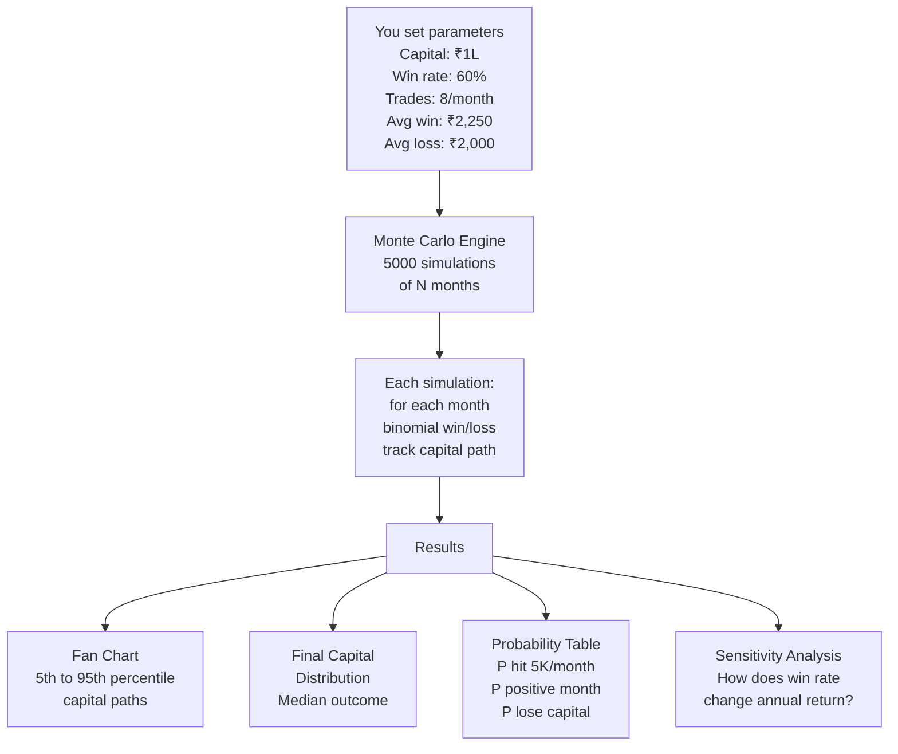

### Expected results at 60% win rate

| Metric | Value |
|--------|-------|
| Expected Monthly P&L | ₹5,810 |
| Probability of positive month | 82.5% |
| Probability of hitting ₹5K/month | 52.6% |
| Sharpe Ratio | 3.13 |
| Annual return | ~70% |
| Worst 3-month streak | -₹7,500 (within cash reserve) |

---

## 14. Trade Journal

The trade journal is your **feedback loop** — the most important page for long-term improvement.

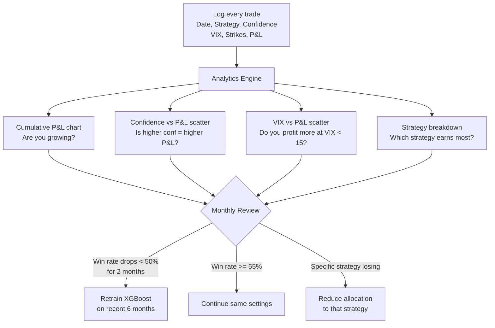

### What to look for in monthly review

After 20+ trades, open the Trade Journal and check:

1. **Confidence vs P&L scatter**: If low-confidence trades (55-60%) are losing and high-confidence (70%+) are winning → the model is working, just be more selective
2. **VIX vs P&L scatter**: If your losses cluster around VIX 18-22 → you were buying options in wrong regime
3. **Strategy breakdown**: If Bear Call Spreads are losing consistently → the model's DOWN predictions may be weaker, reduce those
4. **Win rate trend**: If it was 65% in month 1 and now 48% → retrain the model on recent data

---

## 15. Every Page in the Dashboard

### Page 1: Dashboard (Home)

The command center. Shows everything at a glance.

| Section | What you see | What it tells you |
|---------|-------------|------------------|
| Top metrics | Expected P&L, Win%, Sharpe, Annual return | System health summary |
| Monte Carlo histogram | Distribution of 10,000 simulated months | Where your monthly P&L realistically lands |
| Capital allocation pie | 40% spreads, 20% buying, 40% reserve | How ₹1L is deployed |
| VIX strategy map | Highlighted current regime | Which strategy to use today |
| Annual return by accuracy | Bar chart 55% to 65% | Impact of improving your model |
| 12-month compounding | Line chart of capital growth | What the year looks like |
| Implementation checklist | Phase 1-4 progress | Where you are in the journey |

---

### Page 2: Data Explorer

Inspect your raw CSV data before trusting the model.

| Tab | Contents |
|-----|----------|
| Nifty Daily | Candlestick chart, return distribution, key stats |
| India VIX | Full history with regime zones at 15, 20, 25 |
| PCR + FII | PCR chart with 1.0/1.2/0.8 lines, FII bar chart |
| Bank Nifty | Price chart for correlation context |
| SP500 | Global context — how US market correlates |
| Master Dataset | Build all features, see counts, sample rows |

---

### Page 3: Signal Engine

The most important page. Use this daily.

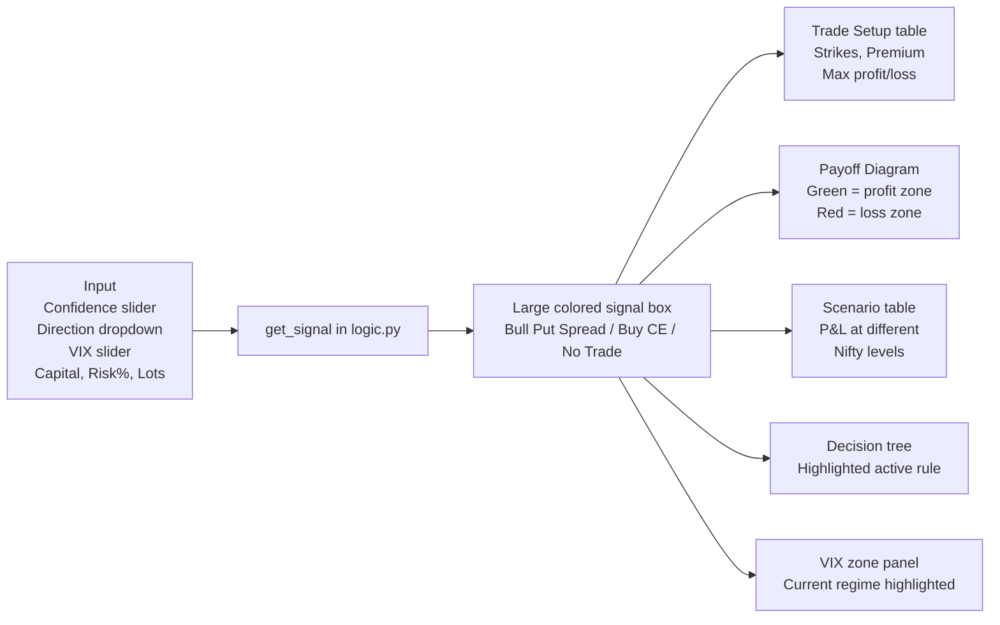

---

### Page 4: P&L Simulator

Use this to understand realistic expectations and stress-test parameters.

**Key inputs to experiment with:**
- Drop win rate to 55% → see conservative case
- Increase months to 24 → see 2-year projection
- Reduce avg win to ₹1,500 → see impact of smaller spreads

---

### Page 5: Model Builder

Train the actual XGBoost model on your CSV data.

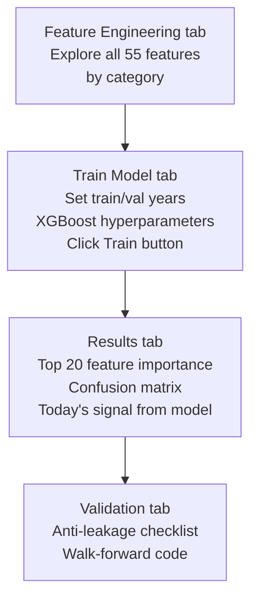

**After training, the model is saved to `st.session_state` and automatically feeds the Signal Engine page.**

---

### Page 6: Trade Journal

Log every trade. Review monthly. Improve.

---

### Page 7: Strategy Guide

Reference material for all 4 strategies + Golden Rules with interactive payoff charts.

---

## 16. Frequently Asked Questions

**Q: The model shows NO TRADE most days. Is that normal?**

Yes. Confidence < 55% happens on ~40% of days. That is the system working correctly. Missing a trade costs zero. Taking a bad trade costs ₹2,000. Over 100 trades, patience is worth thousands of rupees.

---

**Q: What if VIX is 21 but my model says 75% confident UP?**

Rule 5 overrides Rule 3 in this case. At 75% confidence, you still want to trade. But VIX 21 means options are expensive. So you use a Bull Put Spread instead of Buying a CE. You collect premium instead of paying overpriced premium.

---

**Q: The model accuracy is 57%. That seems low. Should I retrain?**

57% is genuinely good. The math: 57% win rate × ₹2,250 avg win − 43% × ₹2,000 avg loss = +₹422 expected value per trade. Over 8 trades/month = ₹3,376/month. Add the credit spread component and you reach ₹5K+. Accuracy is not the goal. Expected value per trade is the goal.

---

**Q: I trained the model but the Signal Engine page shows wrong confidence. Why?**

Go to Model Builder → Results tab. It will show "Today's Model Signal" with the exact probability. The Signal Engine pre-fills from session state. If you restarted Streamlit, the model was cleared from memory — retrain it.

---

**Q: Can I use this for Bank Nifty options?**

The model is trained on Nifty data. Bank Nifty is more volatile (ATR ~2× Nifty). You would need to retrain on Bank Nifty OHLCV and adjust position sizes. The system architecture supports this — just change the primary CSV in `data_loader.py`.

---

**Q: How often should I retrain the model?**

Retrain when: (1) win rate drops below 50% for 2 consecutive months, (2) a major market regime change happens (e.g., post-COVID, 2022 rate hike cycle), (3) you add new data sources. Otherwise, quarterly retraining on the latest 3 years of data is sufficient.

---

**Q: What is the difference between `dropna=True` and `dropna=False` in features.py?**

`dropna=True` is used for training — it drops the first ~200 rows where rolling windows haven't fully computed yet. `dropna=False` is used for live prediction — it forward-fills the last row so today's data always produces a valid prediction even if some VIX or PCR data is missing.

---

## 17. Disclaimer

This software is for **educational and research purposes only**.

- Options trading involves **substantial financial risk**
- Past performance (including backtest results) does not guarantee future returns
- The 60% accuracy and ₹5,000/month targets are **statistical expectations**, not guarantees
- You can lose more than you invest in leveraged instruments
- Always consult a **SEBI-registered investment advisor** before trading
- The authors are not responsible for any trading losses

**Never trade with money you cannot afford to lose.**

---

*System version 3.2.0 · Last updated March 2026 · Built on 10,000 Monte Carlo simulations + XGBoost + India VIX 2001–present*
